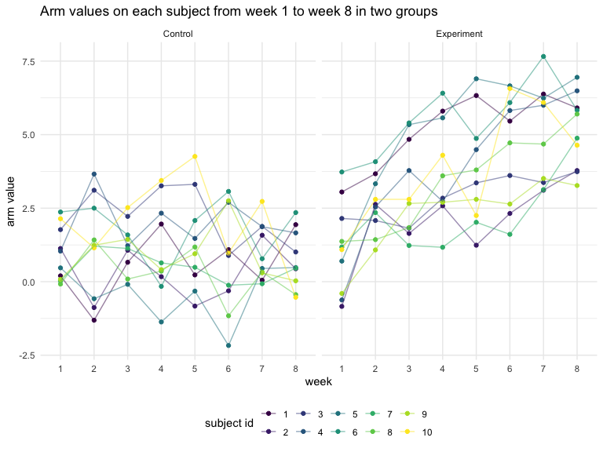
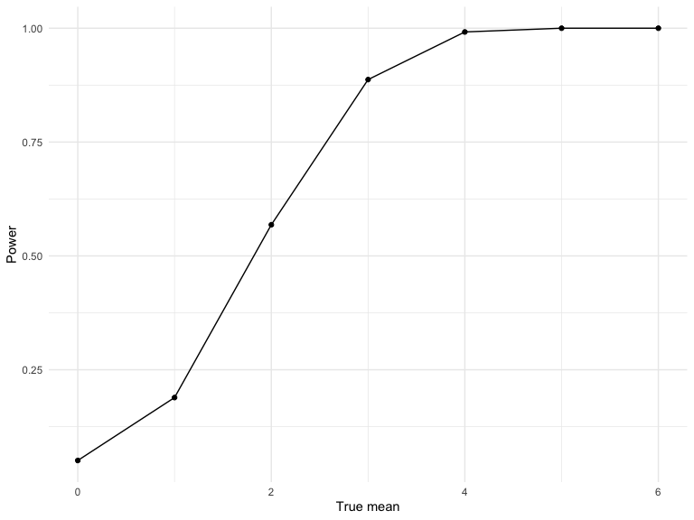
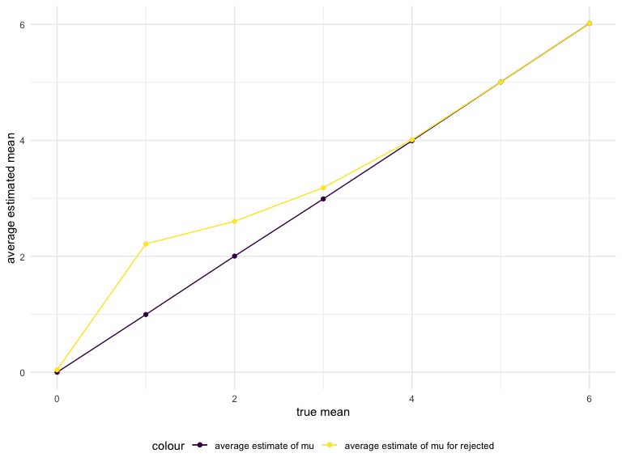

p8105_hw5_tl3195
================
Tingyi Li
2023-11-14

\#Problem 2

Import data and iterate over file names and read in data

``` r
hw5_data=
  tibble(list.files("./data"))|>
  mutate(files=paste(list.files("./data")))

read_data=function(x) {
  data=read_csv(paste0("./data/", x))|>
    mutate(files_names=x)
}

arm = map_df(hw5_data$files, read_data)
```

    ## Rows: 1 Columns: 8
    ## ── Column specification ────────────────────────────────────────────────────────
    ## Delimiter: ","
    ## dbl (8): week_1, week_2, week_3, week_4, week_5, week_6, week_7, week_8
    ## 
    ## ℹ Use `spec()` to retrieve the full column specification for this data.
    ## ℹ Specify the column types or set `show_col_types = FALSE` to quiet this message.
    ## Rows: 1 Columns: 8
    ## ── Column specification ────────────────────────────────────────────────────────
    ## Delimiter: ","
    ## dbl (8): week_1, week_2, week_3, week_4, week_5, week_6, week_7, week_8
    ## 
    ## ℹ Use `spec()` to retrieve the full column specification for this data.
    ## ℹ Specify the column types or set `show_col_types = FALSE` to quiet this message.
    ## Rows: 1 Columns: 8
    ## ── Column specification ────────────────────────────────────────────────────────
    ## Delimiter: ","
    ## dbl (8): week_1, week_2, week_3, week_4, week_5, week_6, week_7, week_8
    ## 
    ## ℹ Use `spec()` to retrieve the full column specification for this data.
    ## ℹ Specify the column types or set `show_col_types = FALSE` to quiet this message.
    ## Rows: 1 Columns: 8
    ## ── Column specification ────────────────────────────────────────────────────────
    ## Delimiter: ","
    ## dbl (8): week_1, week_2, week_3, week_4, week_5, week_6, week_7, week_8
    ## 
    ## ℹ Use `spec()` to retrieve the full column specification for this data.
    ## ℹ Specify the column types or set `show_col_types = FALSE` to quiet this message.
    ## Rows: 1 Columns: 8
    ## ── Column specification ────────────────────────────────────────────────────────
    ## Delimiter: ","
    ## dbl (8): week_1, week_2, week_3, week_4, week_5, week_6, week_7, week_8
    ## 
    ## ℹ Use `spec()` to retrieve the full column specification for this data.
    ## ℹ Specify the column types or set `show_col_types = FALSE` to quiet this message.
    ## Rows: 1 Columns: 8
    ## ── Column specification ────────────────────────────────────────────────────────
    ## Delimiter: ","
    ## dbl (8): week_1, week_2, week_3, week_4, week_5, week_6, week_7, week_8
    ## 
    ## ℹ Use `spec()` to retrieve the full column specification for this data.
    ## ℹ Specify the column types or set `show_col_types = FALSE` to quiet this message.
    ## Rows: 1 Columns: 8
    ## ── Column specification ────────────────────────────────────────────────────────
    ## Delimiter: ","
    ## dbl (8): week_1, week_2, week_3, week_4, week_5, week_6, week_7, week_8
    ## 
    ## ℹ Use `spec()` to retrieve the full column specification for this data.
    ## ℹ Specify the column types or set `show_col_types = FALSE` to quiet this message.
    ## Rows: 1 Columns: 8
    ## ── Column specification ────────────────────────────────────────────────────────
    ## Delimiter: ","
    ## dbl (8): week_1, week_2, week_3, week_4, week_5, week_6, week_7, week_8
    ## 
    ## ℹ Use `spec()` to retrieve the full column specification for this data.
    ## ℹ Specify the column types or set `show_col_types = FALSE` to quiet this message.
    ## Rows: 1 Columns: 8
    ## ── Column specification ────────────────────────────────────────────────────────
    ## Delimiter: ","
    ## dbl (8): week_1, week_2, week_3, week_4, week_5, week_6, week_7, week_8
    ## 
    ## ℹ Use `spec()` to retrieve the full column specification for this data.
    ## ℹ Specify the column types or set `show_col_types = FALSE` to quiet this message.
    ## Rows: 1 Columns: 8
    ## ── Column specification ────────────────────────────────────────────────────────
    ## Delimiter: ","
    ## dbl (8): week_1, week_2, week_3, week_4, week_5, week_6, week_7, week_8
    ## 
    ## ℹ Use `spec()` to retrieve the full column specification for this data.
    ## ℹ Specify the column types or set `show_col_types = FALSE` to quiet this message.
    ## Rows: 1 Columns: 8
    ## ── Column specification ────────────────────────────────────────────────────────
    ## Delimiter: ","
    ## dbl (8): week_1, week_2, week_3, week_4, week_5, week_6, week_7, week_8
    ## 
    ## ℹ Use `spec()` to retrieve the full column specification for this data.
    ## ℹ Specify the column types or set `show_col_types = FALSE` to quiet this message.
    ## Rows: 1 Columns: 8
    ## ── Column specification ────────────────────────────────────────────────────────
    ## Delimiter: ","
    ## dbl (8): week_1, week_2, week_3, week_4, week_5, week_6, week_7, week_8
    ## 
    ## ℹ Use `spec()` to retrieve the full column specification for this data.
    ## ℹ Specify the column types or set `show_col_types = FALSE` to quiet this message.
    ## Rows: 1 Columns: 8
    ## ── Column specification ────────────────────────────────────────────────────────
    ## Delimiter: ","
    ## dbl (8): week_1, week_2, week_3, week_4, week_5, week_6, week_7, week_8
    ## 
    ## ℹ Use `spec()` to retrieve the full column specification for this data.
    ## ℹ Specify the column types or set `show_col_types = FALSE` to quiet this message.
    ## Rows: 1 Columns: 8
    ## ── Column specification ────────────────────────────────────────────────────────
    ## Delimiter: ","
    ## dbl (8): week_1, week_2, week_3, week_4, week_5, week_6, week_7, week_8
    ## 
    ## ℹ Use `spec()` to retrieve the full column specification for this data.
    ## ℹ Specify the column types or set `show_col_types = FALSE` to quiet this message.
    ## Rows: 1 Columns: 8
    ## ── Column specification ────────────────────────────────────────────────────────
    ## Delimiter: ","
    ## dbl (8): week_1, week_2, week_3, week_4, week_5, week_6, week_7, week_8
    ## 
    ## ℹ Use `spec()` to retrieve the full column specification for this data.
    ## ℹ Specify the column types or set `show_col_types = FALSE` to quiet this message.
    ## Rows: 1 Columns: 8
    ## ── Column specification ────────────────────────────────────────────────────────
    ## Delimiter: ","
    ## dbl (8): week_1, week_2, week_3, week_4, week_5, week_6, week_7, week_8
    ## 
    ## ℹ Use `spec()` to retrieve the full column specification for this data.
    ## ℹ Specify the column types or set `show_col_types = FALSE` to quiet this message.
    ## Rows: 1 Columns: 8
    ## ── Column specification ────────────────────────────────────────────────────────
    ## Delimiter: ","
    ## dbl (8): week_1, week_2, week_3, week_4, week_5, week_6, week_7, week_8
    ## 
    ## ℹ Use `spec()` to retrieve the full column specification for this data.
    ## ℹ Specify the column types or set `show_col_types = FALSE` to quiet this message.
    ## Rows: 1 Columns: 8
    ## ── Column specification ────────────────────────────────────────────────────────
    ## Delimiter: ","
    ## dbl (8): week_1, week_2, week_3, week_4, week_5, week_6, week_7, week_8
    ## 
    ## ℹ Use `spec()` to retrieve the full column specification for this data.
    ## ℹ Specify the column types or set `show_col_types = FALSE` to quiet this message.
    ## Rows: 1 Columns: 8
    ## ── Column specification ────────────────────────────────────────────────────────
    ## Delimiter: ","
    ## dbl (8): week_1, week_2, week_3, week_4, week_5, week_6, week_7, week_8
    ## 
    ## ℹ Use `spec()` to retrieve the full column specification for this data.
    ## ℹ Specify the column types or set `show_col_types = FALSE` to quiet this message.
    ## Rows: 1 Columns: 8
    ## ── Column specification ────────────────────────────────────────────────────────
    ## Delimiter: ","
    ## dbl (8): week_1, week_2, week_3, week_4, week_5, week_6, week_7, week_8
    ## 
    ## ℹ Use `spec()` to retrieve the full column specification for this data.
    ## ℹ Specify the column types or set `show_col_types = FALSE` to quiet this message.

``` r
arm
```

    ## # A tibble: 20 × 9
    ##    week_1 week_2 week_3 week_4 week_5 week_6 week_7 week_8 files_names
    ##     <dbl>  <dbl>  <dbl>  <dbl>  <dbl>  <dbl>  <dbl>  <dbl> <chr>      
    ##  1   0.2   -1.31   0.66   1.96   0.23   1.09   0.05   1.94 con_01.csv 
    ##  2   1.13  -0.88   1.07   0.17  -0.83  -0.31   1.58   0.44 con_02.csv 
    ##  3   1.77   3.11   2.22   3.26   3.31   0.89   1.88   1.01 con_03.csv 
    ##  4   1.04   3.66   1.22   2.33   1.47   2.7    1.87   1.66 con_04.csv 
    ##  5   0.47  -0.58  -0.09  -1.37  -0.32  -2.17   0.45   0.48 con_05.csv 
    ##  6   2.37   2.5    1.59  -0.16   2.08   3.07   0.78   2.35 con_06.csv 
    ##  7   0.03   1.21   1.13   0.64   0.49  -0.12  -0.07   0.46 con_07.csv 
    ##  8  -0.08   1.42   0.09   0.36   1.18  -1.16   0.33  -0.44 con_08.csv 
    ##  9   0.08   1.24   1.44   0.41   0.95   2.75   0.3    0.03 con_09.csv 
    ## 10   2.14   1.15   2.52   3.44   4.26   0.97   2.73  -0.53 con_10.csv 
    ## 11   3.05   3.67   4.84   5.8    6.33   5.46   6.38   5.91 exp_01.csv 
    ## 12  -0.84   2.63   1.64   2.58   1.24   2.32   3.11   3.78 exp_02.csv 
    ## 13   2.15   2.08   1.82   2.84   3.36   3.61   3.37   3.74 exp_03.csv 
    ## 14  -0.62   2.54   3.78   2.73   4.49   5.82   6      6.49 exp_04.csv 
    ## 15   0.7    3.33   5.34   5.57   6.9    6.66   6.24   6.95 exp_05.csv 
    ## 16   3.73   4.08   5.4    6.41   4.87   6.09   7.66   5.83 exp_06.csv 
    ## 17   1.18   2.35   1.23   1.17   2.02   1.61   3.13   4.88 exp_07.csv 
    ## 18   1.37   1.43   1.84   3.6    3.8    4.72   4.68   5.7  exp_08.csv 
    ## 19  -0.4    1.08   2.66   2.7    2.8    2.64   3.51   3.27 exp_09.csv 
    ## 20   1.09   2.8    2.8    4.3    2.25   6.57   6.09   4.64 exp_10.csv

Tidy the result

``` r
arm_data=
  arm|>
  janitor::clean_names()|>
  gather(value = arm_value, key = week, week_1:week_8)|>
  mutate(
    week=as.integer(str_remove(week, "week_")),
    subject_id=as.integer(str_extract(files_names, "[0-9][0-9]")),
    file_names = ifelse(str_detect(files_names, "con"), "Control", "Experiment"),
  )|>
  mutate(across(.cols = c(files_names, week, subject_id), as.factor)) |>
  select(file_names, subject_id, week, arm_value)

arm_data
```

    ## # A tibble: 160 × 4
    ##    file_names subject_id week  arm_value
    ##    <chr>      <fct>      <fct>     <dbl>
    ##  1 Control    1          1          0.2 
    ##  2 Control    2          1          1.13
    ##  3 Control    3          1          1.77
    ##  4 Control    4          1          1.04
    ##  5 Control    5          1          0.47
    ##  6 Control    6          1          2.37
    ##  7 Control    7          1          0.03
    ##  8 Control    8          1         -0.08
    ##  9 Control    9          1          0.08
    ## 10 Control    10         1          2.14
    ## # ℹ 150 more rows

Make a spaghetti plot showing observations on each subject over time.

``` r
arm_data|>
  ggplot(aes(week, arm_value, color=subject_id)) + 
  geom_point() + geom_line(aes(group=subject_id), alpha=0.5) +
  facet_grid(~file_names) +
  labs(x="week", 
       y="arm value",
       title="Arm values on each subject from week 1 to week 8 in two groups", col="subject id")
```



There appears an general increasing trend in arm values over 8 weeks in
experiment group. In contrast, there is no clear pattern of arm values
for each subject over 8 weeks in control group. Moreover, the largest
arm value in control group is below 5.

\#Problem 3

Generate 5000 datasets from the model

``` r
set.seed(1)
n = 30
sigma = 5
mu_assigned = 0:6
alpha = 0.05
simulations = 5000

sim_results = map_dfr(mu_assigned, function(mu) {
  tibble(mu = mu,
         sim = map(1:simulations, ~t.test(rnorm(n, mu, sigma))),
         estimate = map_dbl(sim, ~broom::tidy(.x)$estimate),
         p_value = map_dbl(sim, ~broom::tidy(.x)$p.value),
         reject = p_value < alpha)
})
```

Make a plot showing the proportion of times the null was rejected (the
power of the test) on the y axis and the true value of mu on the x axis.

``` r
proportion_results <- sim_results |>
  group_by(mu)|>
  summarise(avg_mu_hat = mean(estimate),
            avg_mu_hat_reject = mean(estimate[reject]),
            power = mean(reject))
plot = proportion_results|>
  ggplot(aes(x = mu, y = power)) + geom_point() + geom_line() +
  labs(x = "True mean",
       y = "Power")

plot
```



There is a positive association between effect size and power.
Specfically, when the true mean increases from 0 to 6, the power of the
test also increases. The power of the test seems to increase drastically
when the true mean increases from 0 to 2 and starts to slow down from 2
to 4. The plot seems to have minimal additional impact on power when the
true mean values between 4 to 6. This relationship shows a concept in
hypothesis test that a larger effect size makes the probability of
correctly rejecting the null hypothesis/detecting the true effect
higher.

Make a plot showing the average estimate of mu on the y axis and the
true value of mu on the x axis. Overlay on the first the average
estimate of mu only in samples for which the null was rejected on the y
axis and the true value of mu on the x axis.

``` r
estimate_plot <- proportion_results|>
  ggplot(aes(x=mu)) + 
  geom_point(aes(y = avg_mu_hat, color = "average estimate of mu")) +
  geom_line(aes(y = avg_mu_hat, color = "average estimate of mu")) +
  geom_point(aes(y = avg_mu_hat_reject, color = "average estimate of mu for rejected")) +
  geom_line(aes(y = avg_mu_hat_reject, color = "average estimate of mu for rejected")) +
  labs(
    x = "true mean",
    y = "average estimated mean")

estimate_plot
```



The sample average of mu_hat across tests for which the null is rejected
is not approximately equal to the true value of mu. Specifically, the
estimated estimated mean is higher than the true mean when the null
hypothesis is rejected. This might be attributed to overestimate of
effect size because of random sampling variability.
